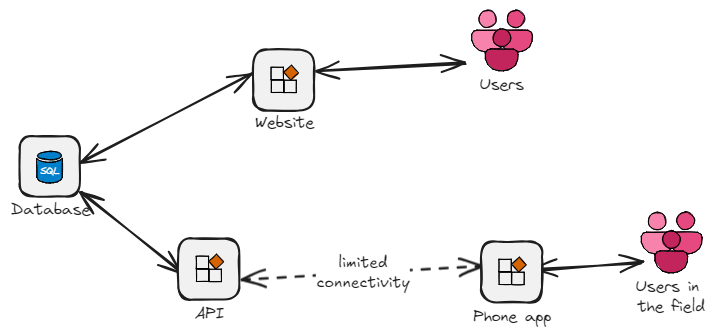

# BeepTracker

This is a proof of concept solution to assist with recording kiwi signals/beeps for tracked kiwi in the Kaitake Ranges and Taranaki Maunga. 

## Quickstart

The Beep Tracker android phone app can be run stand alone to record information on your phone to later be manually transcribed to a database. You can install it on a phone by installing the apk file here https://github.com/kelvinperrie/BeepTracker/releases/tag/v1.2.

There are (slightly outdated) screenshots of the phone app further down the page.

## Background

A subset of the kiwi released in the Kaitake ranges and Taranaki Maunga are tracked to act as an indicator for the rest of the population (e.g. are they breeding, where are they moving, have they been attacked by predators etc). Tracked kiwis have a transmitter attached to their leg which sends out a signal that can be received by a handheld receiver and aerial. On 10 minute intervals the kiwi's transmitter will transmit a sequence of beeps. Those beeps can be decoded to show things like when the kiwi last left the nest, or how long ago their eggs hatched. This 'beep record' looks something like this, with eight pairs of beeps:

5,6, 2,2 2,2 11,9 7,9 10,13 5,9 4,7

The receiver and aerial are usually held by a single person while attempting to record the beeps. Some people record them on paper, some people record them on to a notes app on their phones, some people use an audio recording. All these methods are difficult when you have your hands full of a receiver and aerial. A notes app can be challenging to use as the on screen keyboard is small and holds a lot of buttons not needed for this purpose. Additionally, since the phone is being held one handed it can be hard to reach all the entry keys on the on screen keyboard.

These beep records collected in the field are then later transcribed into an online database which is accessed via a website. Typically when you are in the field scanning for kiwi you won't have connectivity to access the webpage and there is no offline solution (e.g. a mobile device application) to collect data. The webpage is not mobile friendly and is built on dated technology, but works well and has a lot of functionality. It does not have a offline way to collect and sync data, and does not have an API to allow for the creation of a mobile device application.

The existing process looks like this:

## Proposed Solution

This solution is an attempt to replace a notes app on a phone with something that is custom desgined to make it easier record the beeps and to remove the transcription process from phone to online database (i.e. automatically upload the captured beep data to the database). 

Features:
* Allows for the storing of beep records locally on the device i.e. doesn't require internet connectivity
* When used as a stand alone app beep records can be accessed at a later date for transcription to the online database, and then marked as 'uploaded' to track which ones have been completed
* If linked to the API and database then beep records can be pushed to the database when the device has connectivity
* The UI for recording beeps is skewed to one side of the phone to help with entry as it is usually used one handed (to allow for other hand to hold the aerial and receiver)
* The UI is simplified to assist with easy recording i.e no unnecessary keys like when using on-screen keyboard
* The recorded date/time is automatically entered when the first beep is recorded, with some button to help with time entry (e.g. a button to take 5 minutes off the currently set time)
* The lat/lng can be retrieved from the device via a button push - recording the location the scanning was done is useful for other people and auditing

The mobile application has been built in .net maui so in theory can create both andriod and iOS apps - I have not created iOS installers as you're required to own an iOS device to build them. It is currently in an internal testing release (limited to specified users) on the google play store and there is an apk file under the 'installers' folder (or can also be done via 'releases') that can be used to manually install on a phone. The website is built in blazor and for now is hosted on an Azure free tier. The API is REST API built in .net Web API.

## Phone app

The beep records list page contains a list of all the records that have been created:

The beep record detail page allows creation of new beep records for a bird:

